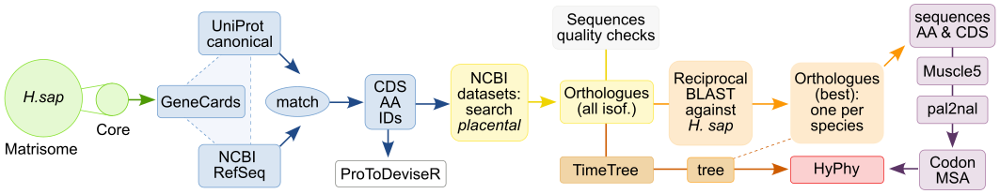

# ECM evolution: orthologues identification and evolutionary analysis pipeline. 

The [ECMME](https://github.com/izzilab/ecmme/) (ECM Molecular Evolution) browser is a user-friendly, open-access web resource that enables interactive visualization of per-residue evolutionary selection pressures across 272 core Matrisome proteins in humans. Here, we deposit the preparation pipeline code, used to produce the results presented by ECMME.

[](https://github.com/izzilab/ecmme/)
[](https://doi.org/XXX)
[](https://izzilab-ecmme.share.connect.posit.cloud/)

## Pipeline overview



The UniProt IDs of the core members of the Matrisome from H. sapiens (green) are cross-referenced against GeneCards, UniProt and NCBI RefSeq, yielding a list of updated IDs and sequences (blue). The UniProt IDs are used to generate protein topology schemes in JSON format by ProToDeviseR (white). Orthologues are then retrieved by NCBI Datasets at level Placentalia (yellow), followed by sequence quality checks and filtering (grey). Reciprocal BLAST searches against the human reference are performed to select the best orthologue per species (orange). Amino acid sequences for the orthologues of each Matrisome core member are aligned with MUSCLE5 and the corresponding CDS are converted to codon alignments using pal2nal (purple). The codon alignments are used together with a species tree (brown), obtained from TimeTree (trimmed accordingly, to represent only the species available in the CDS) as input for HyPhy evolutionary analyses by methods MEME and FUBAR (red).

## Operating system
This pipeline is designed to run on GNU/Linux. Development was one on [CRUX](https://crux.nu/) with all necessary software installed from the ports at the distribution's [portdb](https://crux.nu/portdb/).

## Required files
These are the initially required files in order to rerun the whole pipeline (`prepare.R`):
```
.
├── prepare.R
├── sh
│   ├── blastPrep.sh
│   ├── blastRunParallel.sh
│   ├── download_orthologues.sh
│   ├── download_uniprot.sh
│   ├── download_uniprot_txt.sh
│   ├── gblocksRun.sh
│   ├── hyphyRun.sh
│   ├── muscle5Run.sh
│   └── pal2nalRun.sh
└── spreadsheets
    ├── Hs_Matrisome_Masterlist_Naba et al_2012.xlsx
    └── species.gnumeric
```

## Required R packages
```R
# From CRAN
install.packages("openxlsx")
install.packages("gnumeric")
install.packages("jsonlite")
install.packages("processx")
install.packages("pheatmap")
install.packages("seqinr")
install.packages("ape")
install.packages("dplyr")
install.packages("ggplot2")
install.packages("stringr")
install.packages("rentrez")
install.packages("gggenomes")

# From Bioconductor
install.packages("BiocManager")
BiocManager::install("org.Hs.eg.db")

# From GitHub (https://github.com/Izzilab/protodeviser)
devtools::install_github("izzilab/protodeviser")
```

## Required system-level dependencies
* [NCBI BLAST Plus](https://ftp.ncbi.nlm.nih.gov/blast/executables/blast+/): BLAST+ Command Line Applications 
* [NCBI Datasets](https://github.com/ncbi/datasets/releases): NCBI Datasets command-line tools
* [GNU/Parallel](http://www.gnu.org/software/parallel/): A shell tool for executing jobs in parallel using one or more computers.
* [wget](http://www.gnu.org/software/wget/): A network utility for downloading content from the Web
* [Gblocks](https://molevol-ibe.csic.es/): Select blocks of evolutionarily conserved sites
* [HyPhy](https://github.com/veg/hyphy/releases): Hypothesis Testing using Phylogenies
* [muscle5](https://github.com/rcedgar/muscle): MUSCLE 5: Next-generation MUSCLE
* [pal2nal](https://bio.tools/pal2nal): Create a codon-based DNA alignment
* [Gnumeric](https://gnome.pages.gitlab.gnome.org/gnumeric-web/) (optional): An open-source spreadsheet program
